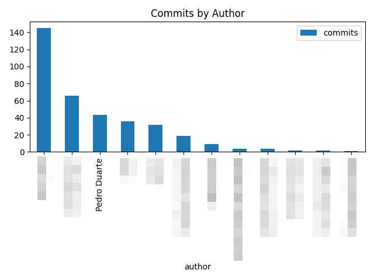
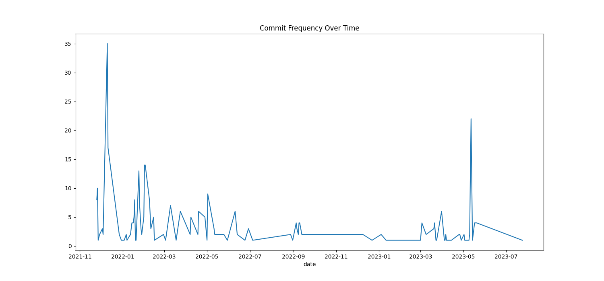
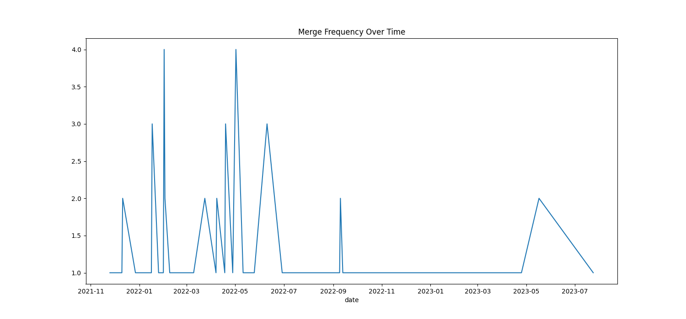

# Git Log Analyzer

This repository contains utilities to extract git logs and create reports from them.

## Requirements

- Python 3.6 or higher
- Git

## Installation

1. Clone the repository
```bash
git clone
```

2. Install the required python packages
```bash
pip install -r requirements.txt
```

## Usage

1. Get the git logs from a git repository
```bash
./collect_git_logs.sh <path_to_git_repo>
```

2. Analyze the git logs
```bash
python create_reports.py <path_to_logs>
```

## Reports

Log files are stored in `Commit Logs/{date}/Logs`, and reports in `Commit Logs/{date}/Reports`.

Example reports:





